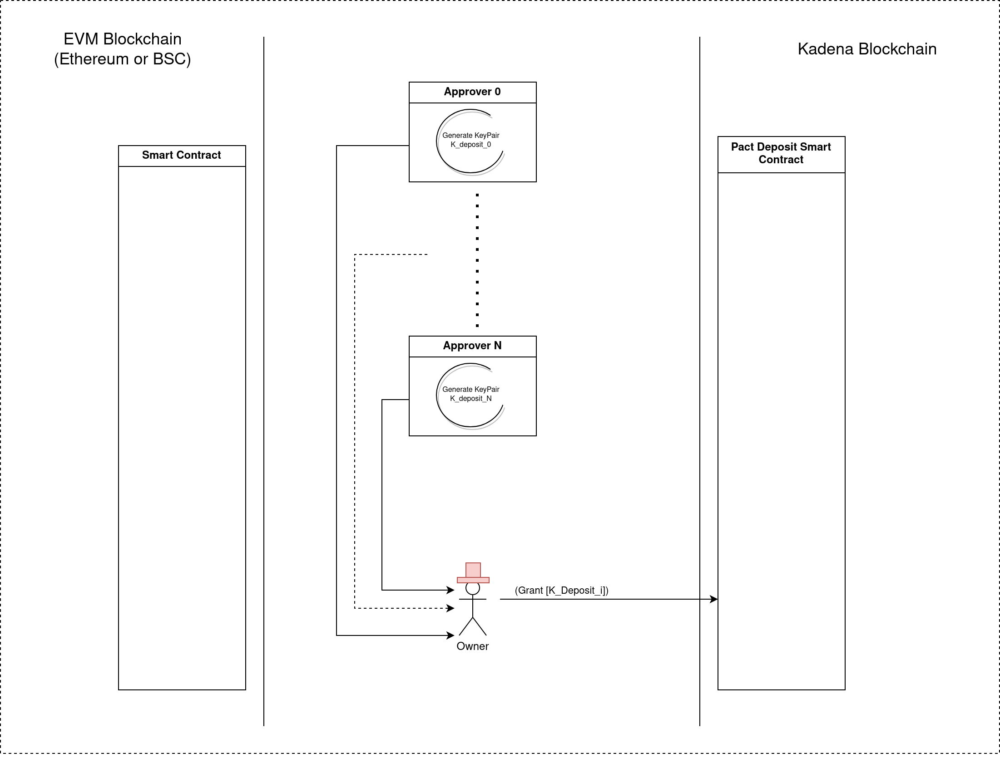
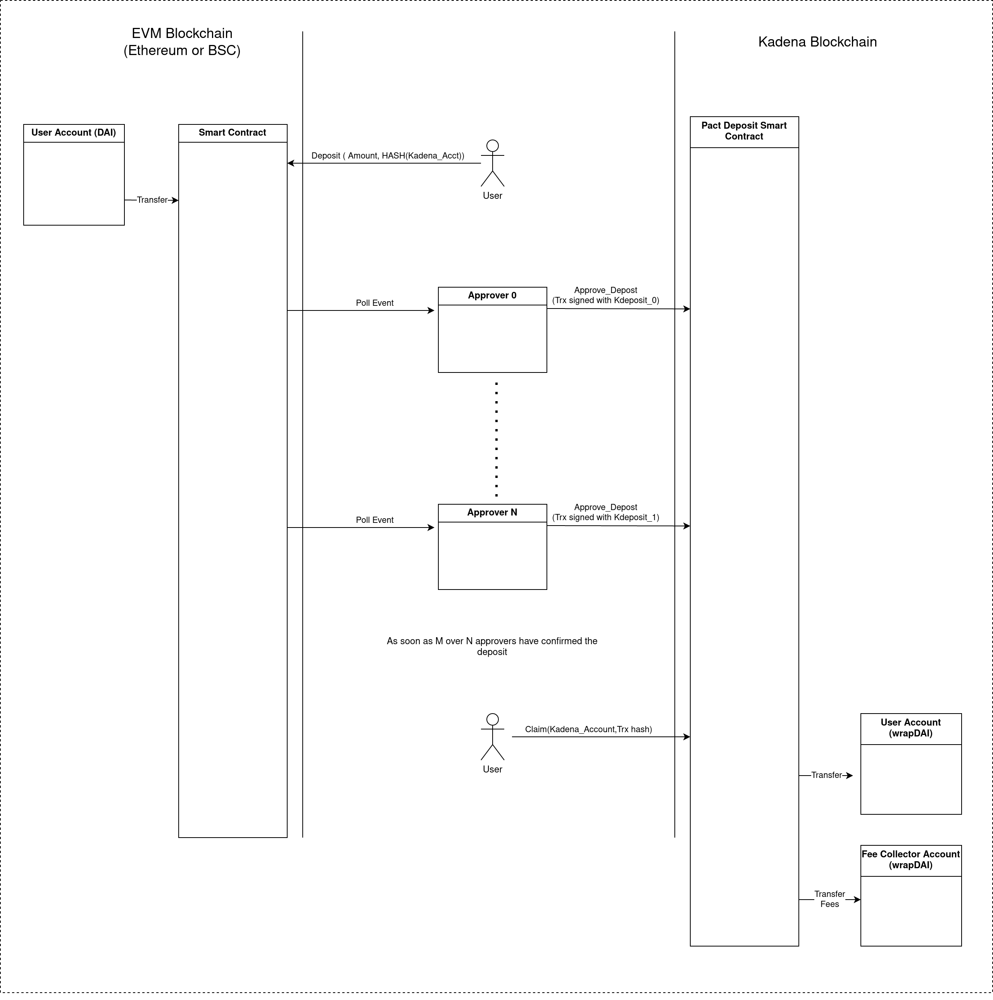
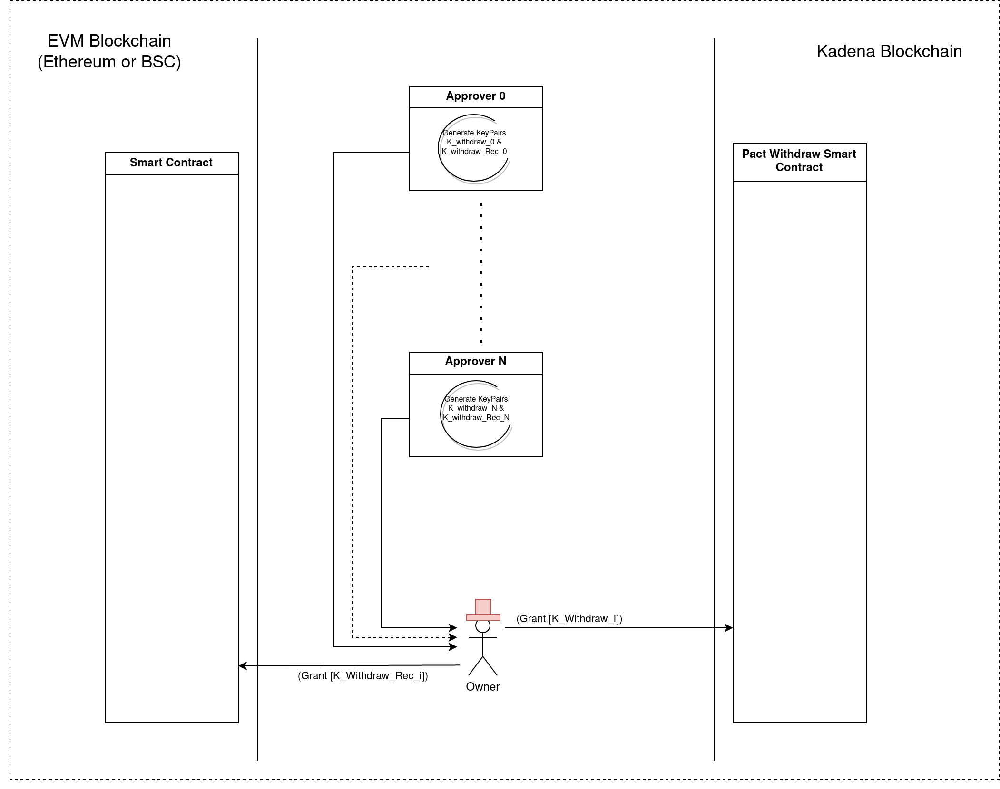
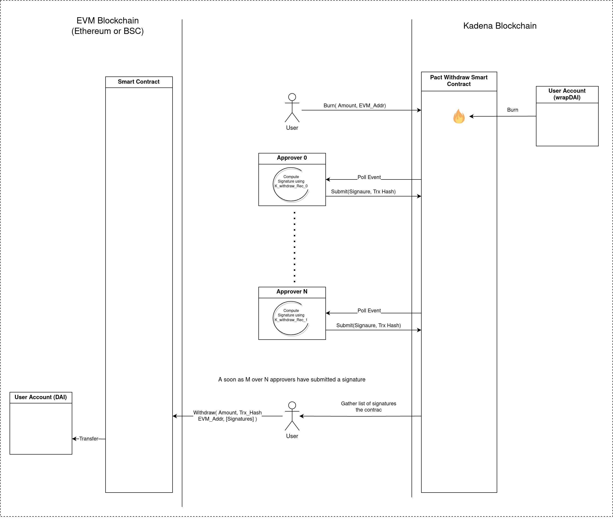

# Pact - EVM Bridge Architecture

## Agents

### User
Wants to interact with blockchains to:
* Wrap native tokens from EVM to Kadena
* Unwrap Kadena tokens to EVM

User interact only with the blockchains

User **trust the Owner**.

### Owner
* Must be trusted by the users
* Has indirectly full access to the funds
* Can Pause / Unpause the contracts
* Grants and Revokes the Approvers

Owner **trust the Approvers**

### Approvers
* Daemons running on external servers
* Receive event from one blockchain, and relay to the others.
* Own private keys
* Only interact with the blockchains, never with the users.

Deposit (EVM -> Kadena) and Withdrawal (Kadena -> EVM) functions can be segregated. (ie: Some approvers may only handle deposits, while some others may only handle withdrawals)

## Smart Contracts

### On the EVM side (Solidity)
* Custody of the native ERC-20 tokens
* Only handle 1 token type
* Unique contract for both functions

### On the Kadena side (Pact)

On the Kadena side deposits and withdrawals flows are completely independent

#### Deposit/Mint contract
* Receives approvals from the approvers
* Stores the approvals
* When requested by the user, mint the wrapped tokens

#### Withdraw/Burn Contract
* When requested by the user burn the wrapped tokens
* Store the signature provided by the approvers

#### Token contract
* Standard Fungible-v2 or v3 token
* Allow minting and burning
* Keep track of total circulating tokens (total minted - total burnt)

## Deposit Flow

### Initial Setup

1. Each approver generates an unique identifier and a private Key: `K_Deposit_n`

2. Each approver sends its public key to **Owner**

3. **Owner** send a transaction to the Deposit Contract to grant the approvers.

### Deposit

1. **User** sends a `Deposit(Amount, Account_Hash)` transaction to the EVM contract.
 * Account_Hash is the Blake2 of the Kadena account

2. During the execution of the contract(on EVM):
  * Funds are being transferred to the contract address
  * An EVM chain event is generated

3. Each approver sees the event and sends an `(Approve EthTxId Amount Account_Hash)` transaction to the Pact deposit contract. The deposit contract store each approval.
   * Transaction signed with it's `K_Deposit_n`

4. **User** monitors the on-chain data until the required number (specified by **Owner**) of approvals has been reached.

5. **User** send a `(Claim EthTxId Amount Account)`. The contract:
  * Verifies that enough approvers have approve the transaction.
  * Checks that Hash(Account) == Account_Hash
  * Mints the wrapped tokens
  * Sends the fee to the *Fee Collector* account
  * Sends the token to *Account*

## Withdrawal flow

### Initial Setup

1. Each approver generates an unique identifier and two privates Key: `K_Withdraw_n` and `K_Withdraw_Recover_n`

2. Each approver sends its public keys to **Owner**

3. For each approver, **Owner** sends:
  * A transaction to the Pact Withdrawal Contract to grant `K_Withdraw_n`
  * A transaction to the EVM contract to grant `K_Withdraw_Recover_n`

5. **User** sends a `(Claim EthTxId Amount Account)`. The contract:
    * Verifies that enough approvers have approve the transaction.
    * Checks that Hash(Account) == Account_Hash
    * Mints the wrapped tokens
    * Sends the fee to the *Fee Collector* account
    * Sends the token to *Account*

### Withdrawal

1. **User** sends a `(Burn Amount EVM_Address)` transaction to the Pact Withdrawal Contract. The contract:
  * Sends the fee to the *Fee Collector* account
  * Burn the wrapped tokens.
  * Generates a Kadena chain event

2. Each approver sees the event and:
  * Generates a signature: `Signature = ECC(KadenaTxId Amount EVM_Address)` with `K_Withdraw_Recover_n`. EIP-712 or something similar can be used.
  * Send a transaction `(Submit KadenaTxId Signature)` to the Pact Withdrawal Contract. Transaction signed with `K_Withdraw_n`. The contract record the signature

3. **User** monitors the on-chain data until the required number (specified by **Owner**) of approvals has been reached, and gather all the signatures.

4. **User** sends a `(Withdraw Amount EVM_Address [Signatures] )` to the EVM contract. The contract:
   * Verifies that at least the required number (specified by **Owner**) of signatures are correct and signers are granted.
   * Transfers the native tokens to the EVM_Address

**Notes**:

* The Pact contract is used as a signature repository and as means of communication between **User** and the approvers. Thereby **User** never discuss directly with the approvers.
* The `K_Withdraw_n` key has no utility for security. Its sole purpose is to prevent random people for spamming the contract.

### System Drawbacks

From a trust perspective, the bridge is definitively **centralized**. **Owner** has full control of the assets, and is responsible of keeping its administrative keys highly secured.

### System Advantages

The system looks like many other centralized bridges. The same model of signing approvals by a central entity and using the EVM function `ecrecovery` has been used many times and is well proven.

But this model has been improved by using a distributed model with many approvers. It has the following advantages:
 * High availability: no single point of failure. This can be improved if some **Approvers** embed their own node and/or use different RPC/endpoints
 * Better security. If a approver is being hacked and its keys disclosed, this is not sufficient to steal money, because **Owner** define a minimum signature count.

 Moreover, by using Kadena, and the features of Pact, **User** never communicate directly with the **Approvers**. This has the following advantages:
   * No direct threat of being exploited using a Web or RPC exploit.
   * The **Approvers** locations and IPs are unknown. They can be spread around the world and hosted by different ISPs.
   * The bridge doesn't depend on a specific Front-end => Can still be used only by transacting with the Blockchains.
